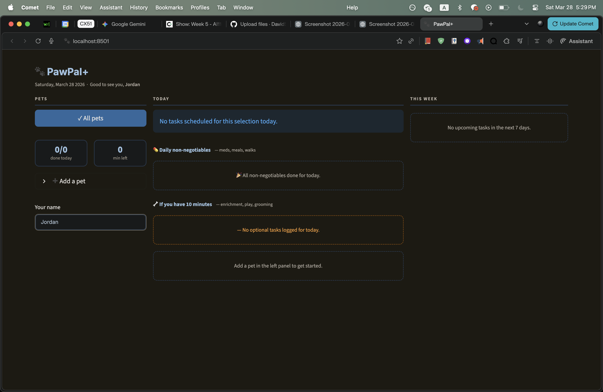

# PawPal+ (Module 2 Project)

You are building **PawPal+**, a Streamlit app that helps a pet owner plan care tasks for their pet.

## Scenario

A busy pet owner needs help staying consistent with pet care. They want an assistant that can:

- Track pet care tasks (walks, feeding, meds, enrichment, grooming, etc.)
- Consider constraints (time available, priority, owner preferences)
- Produce a daily plan and explain why it chose that plan

Your job is to design the system first (UML), then implement the logic in Python, then connect it to the Streamlit UI.

## What you will build

Your final app should:

- Let a user enter basic owner + pet info
- Let a user add/edit tasks (duration + priority at minimum)
- Generate a daily schedule/plan based on constraints and priorities
- Display the plan clearly (and ideally explain the reasoning)
- Include tests for the most important scheduling behaviors

## Features

- Sorted daily schedule view by task time
- Overlap conflict warnings for same-pet task collisions
- Recurring task support (`once`, `daily`, `weekly`) with auto-generated next occurrences
- Task filtering by pet, completion status, and priority
- Priority-aware task ordering (`high`, `medium`, `low`)
- Upcoming task view (next 7 days by default)
- Strong input validation for time, priority, and recurrence values
- Human-readable daily summary output

## Smarter Scheduling

The scheduler uses a few key algorithmic choices in `pawpal_system.py`:

- Time sorting is based on numeric minutes (`start_minutes()`) rather than raw string comparison.
- Conflict detection uses interval overlap (`a.start < b.end` and `b.start < a.end`) after sorting, with an early break for efficiency.
- Recurrence is modeled at the task level (`Task.mark_complete()`), while scheduler orchestration (`Scheduler.mark_task_complete()`) attaches the next task to the right pet.
- Validation happens at object creation in `Task.__post_init__`, preventing invalid schedule state from entering the system.

## Getting started

### Setup

```bash
python -m venv .venv
source .venv/bin/activate  # Windows: .venv\Scripts\activate
pip install -r requirements.txt
```

### Suggested workflow

1. Read the scenario carefully and identify requirements and edge cases.
   Final architecture in this implementation:
   - `Owner`: stores owner identity and pet collection, provides all-task access.
   - `Pet`: stores pet profile and its task list.
   - `Task`: stores scheduling details and recurrence/completion behavior.
   - `Scheduler`: performs sorting, filtering, conflict detection, upcoming views, summaries, and recurrence orchestration.

   Core relationships:
   - `Owner` has many `Pet` objects.
   - `Pet` has many `Task` objects.
   - `Scheduler` uses `Owner` data and coordinates `Task`/`Pet` interactions.

2. Draft a UML diagram (classes, attributes, methods, relationships).
3. Convert UML into Python class stubs (no logic yet).
4. Implement scheduling logic in small increments.
5. Add tests to verify key behaviors.
6. Connect your logic to the Streamlit UI in `app.py`.
7. Refine UML so it matches what you actually built.

## Testing PawPal+

Run the automated test suite with:

python -m pytest

Current tests cover core scheduler reliability checks, including:
- Task completion state changes and recurrence behavior (`once` vs `daily`)
- Pet task-list behavior when adding one or multiple tasks
- Sorting correctness for daily schedules in chronological time order
- Recurrence logic through `Scheduler.mark_task_complete()` creating the next-day task for daily tasks
- Conflict detection when two tasks share duplicate start times for the same pet

Confidence Level: ★★★★☆ (4/5)

Reasoning: All current tests pass (8 passed), and they exercise the most important happy paths plus key edge cases in sorting, recurrence, and conflict detection. Additional confidence could come from more boundary-time and multi-pet conflict scenarios.

## 📸 Demo


