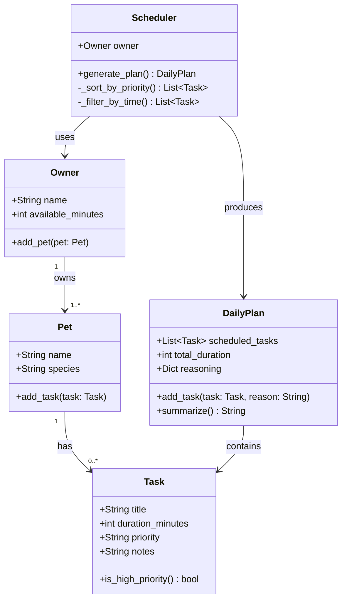

# PawPal+ Class Diagram

```mermaid
classDiagram
    class Owner {
        +String name
        +int available_minutes
        +add_pet(pet: Pet)
    }

    class Pet {
        +String name
        +String species
        +add_task(task: Task)
    }

    class Task {
        +String title
        +int duration_minutes
        +String priority
        +String notes
        +is_high_priority() bool
    }

    class Scheduler {
        +Owner owner
        +generate_plan() DailyPlan
        -_sort_by_priority() List~Task~
        -_filter_by_time() List~Task~
    }

    class DailyPlan {
        +List~Task~ scheduled_tasks
        +int total_duration
        +Dict reasoning
        +add_task(task: Task, reason: String)
        +summarize() String
    }

    Owner "1" --> "1..*" Pet : owns
    Pet "1" --> "0..*" Task : has
    Scheduler --> Owner : uses
    Scheduler --> DailyPlan : produces
    DailyPlan --> Task : contains
```
