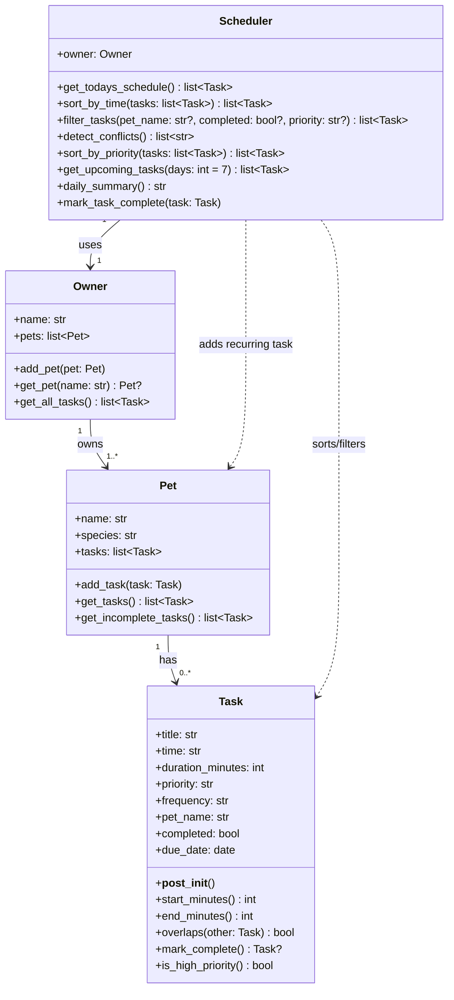

# PawPal+ Class Diagram

```mermaid
classDiagram
    class Owner {
        +name: str
        +pets: list~Pet~
        +add_pet(pet: Pet)
        +get_pet(name: str) Pet?
        +get_all_tasks() list~Task~
    }

    class Pet {
        +name: str
        +species: str
        +tasks: list~Task~
        +add_task(task: Task)
        +get_tasks() list~Task~
        +get_incomplete_tasks() list~Task~
    }

    class Task {
        +title: str
        +time: str
        +duration_minutes: int
        +priority: str
        +frequency: str
        +pet_name: str
        +completed: bool
        +due_date: date
        +__post_init__()
        +start_minutes() int
        +end_minutes() int
        +overlaps(other: Task) bool
        +mark_complete() Task?
        +is_high_priority() bool
    }

    class Scheduler {
        +owner: Owner
        +get_todays_schedule() list~Task~
        +sort_by_time(tasks: list~Task~) list~Task~
        +filter_tasks(pet_name: str?, completed: bool?, priority: str?) list~Task~
        +detect_conflicts() list~str~
        +sort_by_priority(tasks: list~Task~) list~Task~
        +get_upcoming_tasks(days: int = 7) list~Task~
        +daily_summary() str
        +mark_task_complete(task: Task)
    }

    Owner "1" --> "1..*" Pet : owns
    Pet "1" --> "0..*" Task : has
    Scheduler "1" --> "1" Owner : uses
    Scheduler ..> Task : sorts/filters
    Scheduler ..> Pet : adds recurring task
```
